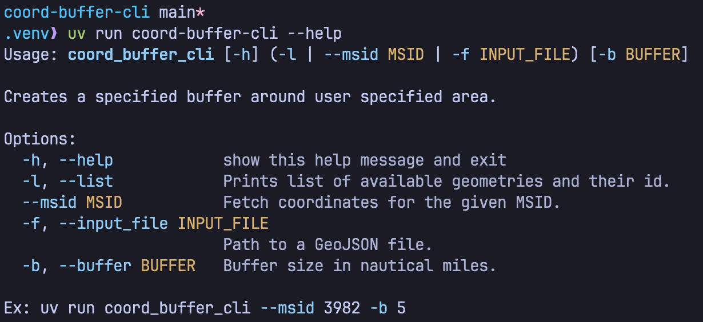
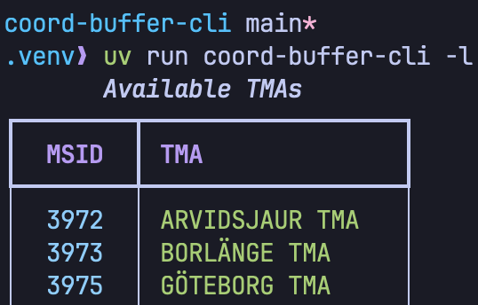
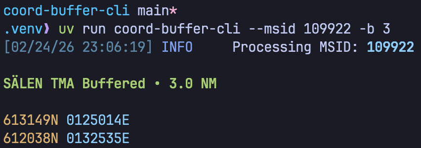

# Coords Buffer

Fetches GeoJSON data based on [LFV echarts](https://daim.lfv.se/echarts) and returns new buffered coordinates based on user input buffer distance (nautical miles).

## Usage

## List TMA's from db

## Output from script, copy & paste into [LFV echarts](https://daim.lfv.se/echarts)

